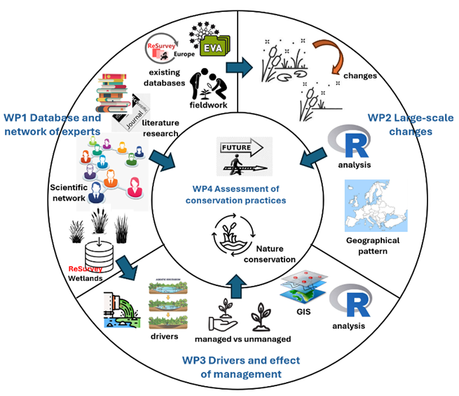

# More about the project

The project is composed of four working packages:

**WP1. Database and network of experts.**

This WP aims to establish a European network of wetland vegetation ecologists and gather most of the existing resurveyed plots and vegetation-plot time series of inland wetland vegetation (including eu- and mesotrophic aquatic, marsh, spring, peatland, annual temporary pond, oligotrophic water vegetation, and wet meadows). We will create a common repository for new wetland resurveys and related information, “ReSurveyWetlands”. This database will eventually be integrated into the ReSurveyEurope database (<https://euroveg.org/resurvey/>), according to the consensus of data contributors.

**WP2. Understanding Large-scale Floristic and Vegetation Changes.**

The goal of this working package is to explore the trends in floristic and vegetation changes across European wetlands over the past 30 years. The geographic scope will encompass Europe, excluding the Nordic Countries, Russia, and Belarus due to insufficient data.

We aim to answer the following questions:

a\) Which wetland vegetation types and habitats are most impacted by floristic and vegetation changes?

b\) How do trends in wetlands vary across different European regions?

c\) Do wetlands in Central European countries tend to become more like those in Southern countries?

**WP3. Drivers and effects of management.**

The goal of this working package is to explore the drivers of vegetation changes across different wetland types and trends in managed versus unmanaged wetlands.

We will answer the following questions:

a\) What are the main environmental and anthropogenic drivers of floristic and vegetation changes in wetlands?

b\) How do floristic and vegetation changes differ in managed and unmanaged wetlands?

c\) What are the trends for protected and alien species?

**WP4. Assessment of conservation practices.**

The aim of this last working package is to consolidate all the results and develop guidelines for the conservation of wetlands based on our findings. It is based on the following questions:

a\) Are current management practices effective?

b\) How can wetland nature conservation policies be improved?

c\) How can current trends be stopped or reversed? (if necessary)

{width="647"}
