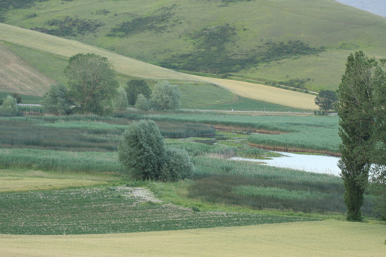

The core team of this project is mainly composed of scientists from Masaryk University (Brno, Czech Republic).

**Flavia Landucci** (Project leader) 

Senior researcher at the Vegetation Science Group, Masaryk University (Czech Republic). Expert in aquatic and marsh habitats and vegetation in Europe.

[*Role in the project:*]{.underline}

**Irena Axmanová**

Assistant Professor at the Vegetation Science Group, Masaryk University (Czech Republic). Vegetation ecologist specialized in alien species, and functional and phylogenetic diversity of plant communities.

[*Role in the project:*]{.underline}

**Michal Hájek**

Professor at Masaryk University, Czech Republic

Expert in fen ecology and European wetland diversity

[*Role in the project:*]{.underline}

**Petra Hájková**

Researcher at Masaryk University, Czech Republic

Expert in wetland vegetation and bryophytes.

[*Role in the project:*]{.underline}

**Svitlana Iemelianova**

Researcher at Masaryk University, Czech Republic

Expert in wetland vegetation and habitats, exotic species.

[*Role in the project:*]{.underline}

**Julia Kellermannová**

PhD student at Masaryk University, Czech Republic

Working with functional traits and vegetation changes.

[*Role in the project:*]{.underline}

**Barbora Klímová**

PhD student at Masaryk University, Czech Republic

[*Role in the project:*]{.underline} GIS, spatial analysis, modeling, visualization 

**Tomáš Peterka**

Researcher at Masaryk University, Czech Republic

Expert in wetland vegetation and vegetation databases

[*Role in the project:*]{.underline}

**Zdenka Preislerová**

Researcher at Masaryk University, Czech Republic

Expert in vegetation databases and wetland classification

[*Role in the project:*]{.underline} Fieldwork, database administration, data analysis, writing 

**Kateřina Šumberová**

Researcher at the Czech Academy of Sciences

Specialist in aquatic and marsh vegetation

[*Role in the project:*]{.underline} Fieldwork, data analysis, writing 

**Lubomír Tichý**

Professor at Masaryk University, Czech Republic

Developer of JUICE and specialist in vegetation classification

[*Role in the project:*]{.underline} Data analysis, writing, and communication with conservation agencies 

**Friedemann von Lampe**

Lecturer at the University of Göttingen, Germany

Expert in long‑term macrophyte vegetation change

[*Role in the project:*]{.underline} Data collection, methodological consultation, analysis, and writing 

