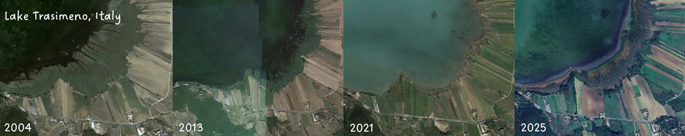

## **Floristic and Vegetation Changes in European Wetlands**

Wetlands are among the most threatened ecosystems in Europe and in the World. Despite their ecological importance, our understanding of long‑term floristic and vegetation changes at the continental scale remains fragmented. Most existing studies focus on local case studies, leaving large‑scale patterns and drivers poorly understood.

WetFlorVegChange addresses this gap by building the first coordinated European network dedicated to wetland resurveys. The project brings together experts, historical data sets, and new field campaigns to assess how wetland vegetation has changed over the last century.

**Our Goals**

Document long‑term changes in wetland flora and vegetation across Europe

Compare trends between managed and unmanaged wetlands

Identify the key drivers of changes (e.g., hydrological alteration, eutrophication, land‑use change, and climate warming)

Assess impacts on protected, rare, and alien species

Provide evidence‑based guidelines for wetland conservation and management

**Our Approach**

We combine permanent and semi-permanent vegetation plots, repeated species pool surveys, historical literature, unpublished datasets, new field resurveys across Europe, GIS‑based spatial analyses, and advanced statistical modeling

The project will establish a dedicated ReSurveyWetlands database, dedicated to wetland vegetation resurveys, and cooperate with the initiative [ReSurvey Europe](https://euroveg.org/resurvey/)

**Funding and Timeline**

WetFlorVegChange is funded by the Czech Science Foundation (GAČR standard project) under project number 26‑22183S and runs from 2026 to 2028.
